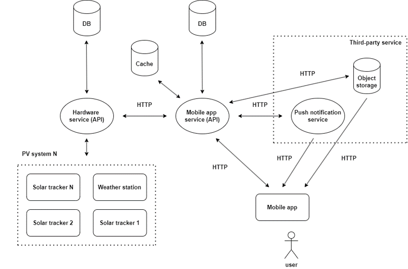
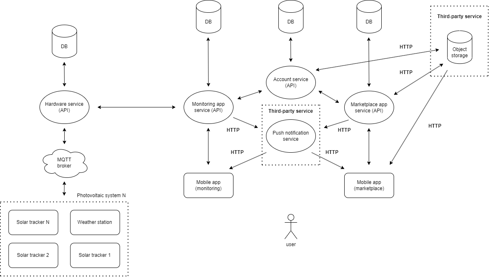

# Съдържание

1. [Проблем](#проблем)
2. [Решение](#решение)
3. [Архитектура](#архитектура)
4. [Използвани технологии](#използвани-технологии)
5. [Бъдещо развитие](#бъдещо-развитие)
6. [Демо](#демо)

# Проблем:

Животът на съвременното общество е немислим без наличието на електричество. Производството на електроенергия става в електрически централи чрез преработване на първични енергоносители – въглища, ядрено гориво, воден потенциал и други. Тези невъзобновяеми източници на енергия обаче постепенно се изчерпват и имат неблагоприятно въздействие върху околната среда.

Ето защо в последните десетилетия се разработват и реализират технологии за добив на енергия от така наречените „възобновяеми източници“. Слънчевата енергия е един от тези неизчерпаеми ресурси. Нейното трансформиране в електрическа енергия се извършва чрез използването на фотоволтаични системи. Автономната фотоволтаична система може да бъде практично и достъпно техническо решение на енергийния проблем за редица държави, свързан с наличието на значителен брой къщи, сгради и стопанства, разположени на места, където няма достъп до електропреносната мрежа.

Докато възобновяемите източници на енергия се утвърждават като ключова част от бъдещето на енергетиката, ефективното използване на тези технологии изисква както иновативни физически системи, така и създаването на съвременни софтуерни решения.

# Решение:

PURPLE представлява система за повишаване на производството на енергия от фотоволтаични панели. Към настоящия момент тя се разделя на две основни части - хардуерна и софтуерна. Дипломната работа се фокусира единствено към софтуерния дял и в частност разработването на мобилно приложение, обединяващо функционалности за добавяне на активна слънцеследяща фотоволтаична система, мониторинг на сензорни данни, механизъм за уведомяване при повреда и достъп до платформа за предлагане на услуги и продажба на продукти в областта на фотоволтаиката.

# Архитектура:

Проектът се състои от четири основни функционални единици – набор от фотоволтаични системи, две сървърни приложения, всяко разполагащо с независима база от данни, и мултиплатформено мобилно приложение. Двете сървърни приложения, предоставящи API за комуникация, са разработени чрез реализацията на REST стил софтуерна архитектура под протокола HTTP. Сървърно приложение №1 обработва заявките от слънцеследящите фотоволтаични системи, а сървърно приложение №2 – тези от мобилното приложение, като също така предоставя и интеграция с хранилище за съхранение на файлове.

# Използвани технологии:

За текущата реализация на проекта са използвани следните технологии:
- Flutter
- Nest.js/TypeScript
- MongoDB
- Azure Blob storage
- Firebase

# Бъдещо развитие:

# Демо:

[Видео демонстрация](assets/demo_video.mp4)
